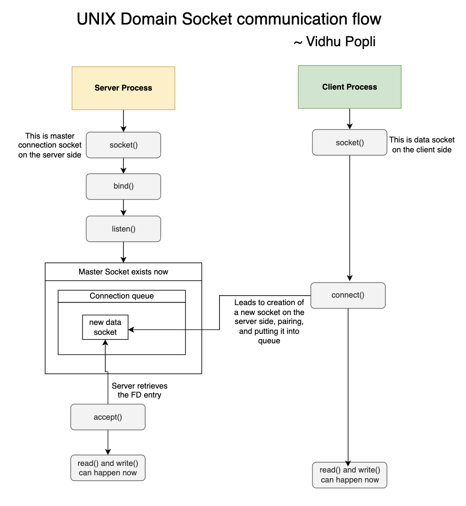

# UNIX DOMAIN SOCKET COMMUNICATION

## About Project

- Goal is to establish socket communication between two processes.
- The client process asks user name as input and then sends that to server.
- The server responds with "Hello, {name-goes-here}".

## Mental Model

- So the way UNIX Domain Socket communication works is that there is a client process and server process.
- The server process is going to make the `socket` system call with relevant arguments to specify that it wants to open up a UNIX Domain Socket not IP Socket. It also specifies the orthognal type of socket, example in our case and most common `SOCK_STREAM`. There is also datgram socket where in the communication isn't supposed ot be continuous.
- Alright so what happens when the server makes the `socket` call is that Kernel sets up a socket object in its memory space. Then it creates a new entry on the FD Table of the server process and points it to the socket object which has been created. The `socket` call returns the FD Integer value of the new entry.
- At this point the socket that the server has set up is not discoverable. It is not communicable.
- The next call that the server makes is the `bind()` system call. This adds a new entry to file system example `/tmp/newlysetupmastersocket`. This path is kind of like the URI in case of IP sockets with an IP address and port number. Just an analogy. Anyways, so what `bind()` system call does is not just set up the file system entry but also associates the socket with the file system entry. Socket is discoverable at this stage but cannot be talked with. It is not listening.
- After this is done, the server makes the `listen()` system call. This marks the socket as listening socket / passive socket. Now this socket is going to be used for making connections with the server. It will never be used to communicate actual data.
- Alright so now the connection socket is in place, also known as the master socket on the server side. Now the client process comes into the picture.
- The client process is going to set up a new socket at its own side. This again is going to be done using the `socket()` call. The argument provided are going to be similar to what the server provided - that is - the client is going to get a unix domain socket created (`AF_UNIX`) of type `SOCK_STREAM`. Kernel sets up this socket on the client side and returns an FD entry. This socket is intended to be data socket not a master socket - so - there is no follow up `bind()` or `listen()` calls made.
- In fact, the very next call that is made is `connect()` which is going to lead to Kernel creating yet another socket (the third one so far) on the server side. The server doesn't know about it yet. Now the data socket on the client side and the newly created data socket on the server socket are going to be paired by kernel. This new socket is going to be put in the connection queue that has been existing since the server created a master socket that is listening.
- Client process can now make `write()` system call to write to its data socket but keep in mind that the server is not going to be seeing it as of yet. This data is going to end up in a data buffer on the server side also known as the read queue. It may fill up if the client process keeps sending data and the server is not making `read()` system call yet. If that happens then the client process is put to sleep by the kernel.
- Anyways so the server process at this point (after having made `socket()` -> `bind()` -> `listen()` calls) is supposed to make the `accept()` call in a loop. This leads to the read queue on the master socket of the server being checked if there is some data socket inside of it. If there is then the kernel helps in returning the FD of this new data socket that is there on the server side but so far the server didn't have any knowledge about even though the client had paired with it (using its own data socket) successfully.
- Now both the client and the server can make `read()` and `write()` system calls on their respective sockets.

## Author

Vidhu Popli
